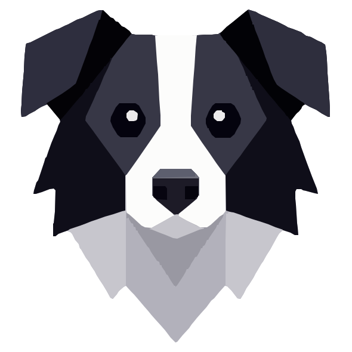

<p align="center">
  
</p>

<h1 align="center">Collie</h1>

<p align="center">
  <b>Your personal AI operations system, running across your devices.</b><br>
  <sub>Give Collie an outcome. It chooses the brain, tools, skills, workers, and device; keeps the
  mission moving; asks when authority is needed; and returns a scoped evidence receipt.</sub>
</p>

<p align="center">
  <a href="https://collie.run">collie.run</a> ·
  <code>collie -p "fix the bug"</code> ·
  <code>collie web</code>
</p>

---

> Reviewing the Collie × Sauna prototype? Start with
> **[ENGINEERING_REVIEW.md](ENGINEERING_REVIEW.md)** for the architecture, trust boundaries,
> real-vs-prototype matrix, focused code paths, and reproducible verification commands.

Collie gives you one persistent AI at the front door and a **Pack** underneath: models, specialist
agents, skills, app connections, and devices. Desktop, terminal, IDE, phone, browser, and messaging
surfaces all enter the same mission runtime instead of creating disconnected chats.

It runs close to your real environment, so it can work in your signed-in browser, desktop, screen,
files, and code. There is no Collie account or product telemetry. Task context goes only to the
model provider and external services you explicitly connect.

Completion is accountable, not magical. Collie records the checks it actually ran, the scope those
checks cover, the permissions used, and what remains unverified. A passing check is evidence for a
named contract—not a claim that every property of the result is proven.

## Why it's different

**Mission-first, not chat-first.** Home opens on a **Work queue**: pending Needs You decisions, open
Missions, then recent outcomes with their evidence state. A Mission survives waits, retries,
restarts, and handoffs; authority requests do not disappear inside an old conversation.

**Local reach with an explicit leash.** Collie can open the site in the browser you are already
logged into, operate the real flow, inspect the screen, and change the code. Sensitive actions are
bounded by permissions, budgets, and user-visible receipts.

**One Collie, many brains.** Models are replaceable execution resources. The user asks for an
outcome; Auto chooses an appropriate run plan, while Advanced controls remain available when a task
needs a specific boundary.

## The ecosystem

| | Capability | What it means |
|---|---|---|
| 🎯 | **Missions** | Durable outcomes with plans, retries, waits, handoffs, evidence, and receipts. |
| 🧠 | **Brains & Pack** | Route work across models and isolated specialist workers while keeping one front-door identity. |
| 🌐 | **Your real browser** | A Chrome extension lets Collie act *in your logged-in browser* — the real session, real cookies — so it can operate sites, not just scrape them. Every action is a fenced, CSRF-checked localhost call. |
| 🖥️ | **Desktop Work queue** | Needs You appears first when non-empty, followed by open Missions and recent evidence-backed outcomes; Missions, Activity, Library, and Pack remain one click away. |
| 🎬 | **Screen recorder** | `collie record` captures screen + camera + mic (Windows and macOS) — a built-in way to demo or document a run. |
| 📱 | **Phone supervision** | Pair once, then follow runs, answer approvals, steer, stop, or start work from the phone. |
| 🔌 | **Library & connections** | Install digest-pinned Skills, Hooks, connection descriptors, templates, and assets. Packages stay inert until their exact version and authority are approved; changes, revocation, or tampering fail closed. |
| 🗓️ | **Personal state** | Native Notes, Tasks, Goals, Calendar and an AI-maintained Journal in one structured local store — `collie today`. Markdown (`today.md`, `profile.md`, `project_summary.md`) is a projection you can read, not the database. |
| 🔁 | **Learned workflows** | Collie notices the sequences you repeat across goals and, past an evidence threshold, offers the next step: *"X is finished — you normally do Y next."* Suggestions only; auto-continuation is opt-in and never crosses the machine. |

## Personal state, and the person layer

A finished run does not just answer — it updates what Collie knows about your work. Completing the
step closes the task, moves the goal, moves the calendar event's preparation, writes today's
journal, and produces the next likely step. Press `Ctrl+Shift+Space` from any app and Collie
already knows the window you were in, the text you selected, and the project you are standing in.

All of that is local, free, and requires no account. **Sauna** is the optional person-level layer
that carries the same goals, tasks, notes, journal, preferences and learned workflows across
devices and time, and can run long jobs while this computer is off. The boundary between them is a
small documented protocol, and the split is deliberate: Sauna should be worth paying for because a
person-level view genuinely needs a cloud — never because the local product was withheld.

> **Collie is AI for this device. Sauna turns it into AI for this person.**

See **[docs/SAUNA_VISION.md](docs/SAUNA_VISION.md)** for the thesis (including exactly what is real
and what is mocked today), **[docs/PERSONAL_AI_PROTOCOL.md](docs/PERSONAL_AI_PROTOCOL.md)** for the
interface, **[docs/MEMORY_ARCHITECTURE_V2.md](docs/MEMORY_ARCHITECTURE_V2.md)** for the hybrid
claim/session/graph architecture, and **[docs/DEMO.md](docs/DEMO.md)** for the walkthrough.

The prototype deliberately exposes three integration modes rather than presenting every path as a
live cloud product:

| Mode | What is live | What is simulated |
|---|---|---|
| Local protocol prototype | Personal state, delta sync, conflicts, tombstones, memory/session envelopes and UI | The remote Sauna store and cloud-task runner use a local adapter |
| Signed-in browser bridge | Collie drives the user's real, logged-in browser session with explicit authorization | No private Sauna API is claimed or emulated |
| MCP server | A live, token-gated Streamable HTTP endpoint; read-only by default, opt-in task/note writes | Public reachability depends on the operator's tunnel or deployment |

## Where it runs

The desktop is Collie's **home and control plane**. The supervisor and durable stores are the
runtime, so work can continue when a window closes. Every surface below reaches that same runtime:

| Surface | Command | Reaches |
|---|---|---|
| **Terminal** | `collie` (TUI) · `collie -p "task"` | anywhere — SSH, CI, tmux |
| **Desktop / Browser Work** | `collie web` | one Work queue for Needs You, open Missions, recent outcomes, evidence, receipts, Library, Activity, and Pack |
| **Global command capsule** | `collie command --install` (Windows) | configurable system-wide shortcut; press once to speak or type an outcome, again to submit into the same Work queue |
| **iPhone** | `collie web --remote` + the companion app | supervise runs, answer approvals, steer, stop, or start work through the TLS + end-to-end encrypted relay; plain-LAN control is intentionally disabled |
| **VS Code** | install `Collie-VSCode.vsix` from the latest release | Collie docked in a sidebar panel (manages its own server) |
| **Editors (ACP)** | `collie acp` | Zed · JetBrains · neovim · VS Code — one adapter, every [ACP](https://agentclientprotocol.com) editor |
| **Streaming / CI** | `collie run "task" --stream-json` | NDJSON events (tool · edit · repro-gate · receipt) |

The composer defaults to an automatically generated Run Plan. Advanced controls keep the underlying
intent, depth, verification policy, effort, service tier, workspace, and Single/Pack strategy
independent. Plan and Review are tool-enforced read-only; Required blocks edited work until its
named post-edit assertion executes and passes. Pack requires a check command so “best” has an
observable meaning.

On Windows, `collie supervisor install` registers a least-privilege per-user supervisor for Web,
Jobs/Missions, automations, and the browser bridge. It restarts crashed workers and catches durable
triggers up after sleep/sign-in; a sleeping or powered-off computer cannot execute work.

## Install

**Windows — one click.** Download **`Collie-Setup.exe`** from the
[latest release](https://github.com/colliehq/collie/releases/latest) and double-click it. A small
app-style installer lays down a self-contained runtime (Python + Collie + semantic memory, nothing to
preinstall) and opens Collie in a native desktop window. On first launch you **pick a brain** — an
existing Claude, Codex, or Grok login is detected and connects in one click; API-key providers are
configured in the environment that starts Collie, so secrets are not stored in the browser.

**macOS — drag and open.** Apple-silicon Macs can download the signed and notarised
**`Collie-arm64.dmg`** from the [latest release](https://github.com/colliehq/collie/releases/latest),
drag Collie to Applications, and open it normally.

**Homebrew status.** The checksum-verifying tap release helper is implemented, but the public tap has
not been published yet; do not use a `brew install` command from an old note. Use the DMG above or the
source install below today. The DMG remains the recommended desktop path because it gives Collie its
own macOS identity and permission prompts.

**Linux and developers — pip.** Python 3.10 or newer is supported. The core is stdlib-only, so the
base install is tiny:

```bash
pip install -e ".[local,dev]"      # from a clone (PyPI publish is planned)
collie setup                       # optional deps, pre-download the memory model, pick a provider
collie                             # the terminal chat (TUI) opens
```

No account, no telemetry, and the core has **zero third-party dependencies** — `mock` and `ollama`
run without any key, and memory works out of the box on BM25 keyword recall.

Optional extras: `pip install ".[local,tui,search]"` — `local` (semantic memory: granite-107m via
onnxruntime, ~55MB, multilingual), `tui` (rich terminal chat), `search` (keyless web search), `acp`
(editor protocol), `browser` (Playwright — only for `collie browser-bridge --browser`, a managed
Chromium with the extension preloaded, for CI or when you'd rather not use your own Chrome). Per-OS
setup — especially the real-browser bridge (`collie browser-bridge` + `harness/browser_ext/`) — is in
**[docs/PLATFORMS.md](docs/PLATFORMS.md)**.

## Quickstart

```bash
collie                     # terminal chat (TUI); first run picks a provider
collie web                 # desktop Work queue — Needs You, open Missions, outcomes, evidence
collie selftest            # $0 deterministic end-to-end (mock model, real tools + memory)

# a real cheap model (provider key in env)
DEEPSEEK_API_KEY=... collie -p "fix the off-by-one in utils/timeparse.py"

# machine-readable / streaming
collie run "fix the bug" --json          # final result object (tokens, cost, verified)
collie run "fix the bug" --stream-json   # live NDJSON: tool · edit · repro-gate · receipt

# fully local, no key
collie run "summarize app.py" --provider ollama --model qwen2.5-coder:7b

# autonomous loop: iterate toward the goal, STOP the first turn an executed check goes green
collie loop --goal "get the suite passing" --until "pytest -q" --max 8

# best-of-N with EXECUTION-based selection: run N isolated attempts, keep only what passes
collie pack "fix the failing test" -n 3 --check "pytest -q" --apply

collie acp                 # serve as an ACP agent (an editor spawns this over stdio)
```

Providers: `mock`, `ollama`, `anthropic`, `claude-agent-sdk`, `anthropic-oauth`, and OpenAI-compatible presets
`deepseek` · `qwen`/`dashscope` · `openrouter` · `moonshot` · `groq` · `zhipu` · `openai`.

---

# For developers

Everything above rests on a small, honest harness. This is what's under it.

## The signature: the verification gate

```
  locate   code_search "parse_duration compound units"   · 4 hits
           › utils/timeparse.py:42  _parse  ············· 0.91

  repro    wrote repro.py · assert parse_duration("1h30m") == 5400
           ✗ FAILING  › got 1800, want 5400              ← gate armed

  edit     utils/timeparse.py  ································· +1 −1
           43 │- total = SECONDS[unit] * int(val)
           43 │+ total += SECONDS[unit] * int(val)

  verify   python repro.py
           ✓ PASSING  › parse_duration("1h30m") == 5400   ← gate green

  ✓ verified in 12.8s · Δ +1 −1 · 3,410 tok · $0.006
```

Other agents check "did the test not error." Collie's gate is stronger: the reproduction carries an
`assert actual == expected` derived from the issue, so a plausible-but-wrong edit fails *loudly* and
drives another repair round. This **`assert-verify`** loop is the core of the harness — a wrong edit
never silently ships as "done." The same idea scales up: `collie loop` stops when a real shell check
exits 0, and `collie pack` picks the best of N attempts by what actually passes.

## What it asks before doing

Collie reaches further than a cloud agent — your logged-in browser, your desktop, your files — so
it draws a line and asks before crossing it. Every tool declares how far it reaches
([`harness/risk.py`](harness/risk.py)), and `collie risk` prints the whole table:

| | | |
|---|---|---|
| **read** | no side effects | never asks |
| **write_local** | changes files here | inside your directory: goes ahead |
| **exec** | runs commands here | inside your directory: goes ahead |
| **external** | **leaves this machine** — your logged-in browser, your desktop, an MCP server | **asks, every time** |

**Running `collie` in your repo is the consent** for the middle two. That is the whole point of the
default `project` mode: an agent that interrupts every `pytest` is not usable, and asking about work
you already asked for is theatre. What you did *not* consent to by launching it is `browser_click`
sending mail under your cookies — so that asks.

```bash
collie -p "fix the bug"                  # project (default)
collie -p "..." --mode plan              # read-only: explore and propose, change nothing
collie -p "..." --mode interactive       # ask before every write and command too
collie -p "..." --mode auto              # ask nothing (sandboxes, CI)
collie risk                              # what collie can reach, grouped by how far
```

Three things worth knowing:

- **"Always allow" is pinned to a target, never to a tool.** Approving clicks on
  `http://localhost:5173` does not approve clicks on your bank — the rule is
  `browser_click → http://localhost:5173`, the origin is re-read live on every call, and it lasts
  one run. There is deliberately no way to express "always allow browser_click".
- **Unattended does not raise the ceiling — it changes who can answer.** When nobody is at the
  machine, the question goes to the Inbox and the run *suspends*; your phone gets a nudge, and you
  answer from there, from the browser, or with `collie inbox allow <id>`. One record, so whoever
  answers first is the one that counts. With no surface at all (piped, CI), off-machine calls are
  refused with a reason the model can work around — never run because no one objected.
- **Only you can widen anything.** A repo's `.collie/allow.toml` is inert until you `collie trust`
  that exact directory; a persona can only *narrow* what you allowed; and the risk overrides have
  no tool and no config hook, because something collie loaded must never be able to reclassify
  itself as harmless.

In an editor, this is the editor's own prompt: collie speaks ACP's `session/request_permission`, so
Zed / JetBrains / neovim render their native approval UI.

```bash
collie inbox                             # what is waiting on you, across runs
collie inbox allow <id>                  # …answer it from anywhere
collie trust                             # let THIS repo's .collie/allow.toml count
collie audit --unexplained               # anything that ran silently without citing a rule
collie risk --set 'mcp__fs__read_*' --risk read    # stop being asked about a server you have read
collie -p "..." --persona webwork        # a role: identity + tools + a stricter mode
```

`collie audit --unexplained` is the one to remember. Every call that runs *without* asking records
the rule that let it through, so the question "why was I not asked about that?" has an answer. It
should always print nothing.

## Architecture (abstractions & seams)

```
                      ┌──────────────── loop.Harness ────────────────┐
   task ─────────────▶│  compose → complete → run tools → verify ✓   │
                      └──┬──────────────┬──────────────┬─────────────┘
     ┌───────────────────┘              │              └───────────────────┐
     ▼                                  ▼                                  ▼
 ContextComposer                  ModelProvider                     ToolRegistry
 STABLE/CONTEXT/VOLATILE          OpenAI-compat · Anthropic ·       read/write/edit/bash/
 + token budgeter                 Ollama · Claude Agent SDK/OAuth   grep/glob + code_search
     ▼                                  │                                  │
 memory.SqliteMemory                    ▼                            recorder.Recorder
 hybrid recall (BM25+dense+RRF)   emit → stream-json / ACP          runs.db (+ dashboard)
```

| Seam (abstract base) | shipped impl |
|---|---|
| `ModelProvider` | **OpenAICompat** (DeepSeek/Qwen/GLM/OpenRouter…) · Anthropic · Ollama · Claude Agent SDK · subscription-OAuth |
| `ToolRegistry` | read/write/**edit** (syntax-gated) · bash · grep · glob · **`code_search`** · **`web_search`** + **`web_fetch`** (keyless) · **`plan`** · **`undo`** · browser · **MCP** (deferred tier + `load_tools`) |
| `EmbeddingProvider` | **OnnxEmbedding** granite-107m (Apache, 55MB, multilingual) · bge-m3 / e5 · jina-v3 opt-in · **BM25-only** when no model |
| `SqliteMemory` | CORE + evidence-gated claims + FTS5 + cosine, hybrid RRF + optional rerank |
| `ContextComposer` | STABLE/CONTEXT/VOLATILE + auto-prefetch · a ~1K-token fixed prefix (kept deliberately lean) |

**`code_search`** extracts the identifiers from a natural-language query and greps the repo (ripgrep,
else grep), ranking files by how many of your terms each contains — so the agent reasons about *where*
to edit instead of grepping blind, with no model and no index to go stale. **`edit_file`** is
exact-match, whitespace-tolerant, and **rejects any edit that would break Python syntax**.
Untrusted web/page content is **fenced as data** (prompt-injection defense), and the browser bridge
refuses any request missing its CSRF header. A token/cost **budget**
(`COLLIE_MAX_COST` / `COLLIE_MAX_TOTAL_TOKENS`) stops a run at a ceiling.

Agent-authored memories are quarantined as proposals: they enter normal recall only after user
attestation or an executed host check. Review them with `collie mem pending`, then
`collie mem approve <id>`, `collie mem attest <id>`, or `collie mem reject <id>` (and use
`collie mem invalidate <id>` on an accepted claim).
`execute_code` is a
batching surface, not an authority shortcut—executable inner calls pass through the same
permission, audit, secret-redaction, checkpoint, and verification-accounting path as ordinary tool
calls; invariant-violating calls are denied and recorded at that boundary. It is **not an OS
sandbox**: direct Python operations such as `open()`, sockets, subprocesses, and ctypes do not pass
through that broker and have the same host authority as `bash`. Run untrusted workloads in a
separately sandboxed container/VM. Process-tree cleanup contains ordinary background children;
on POSIX, deliberately escaping into another session (`setsid`/double-fork) also requires that
external sandbox boundary.

## Platforms

One cross-platform Python codebase — **not** a per-OS fork. The handful of operations that genuinely
differ (kill a process tree on a timeout, secure a token file, convert a path, choose a shell) are
isolated in `harness/plat.py`, so the same wheel runs everywhere.

| OS | Status | Notes |
|---|---|---|
| **Linux** | ✅ native | the primary target |
| **macOS** | ✅ packaged app | signed, notarised Apple-silicon DMG; POSIX underneath |
| **Windows** | ✅ one-click | the packaged installer; the agent prefers the file/search tools over `bash` |
| **WSL2** | ✅ | a Windows-Chrome ↔ WSL bridge uses the LAN IP + `wslpath` (handled for you) |

## Benchmark lab (built in)

Collie measures itself against other harnesses on the **same** task and model — you run it yourself;
no numbers are asserted here:

```bash
DEEPSEEK_API_KEY=... python swe_run.py --n 5                 # SWE-bench Verified (needs Docker)
python -m bench.multirun_eval                                # pass@1 / pass@k / Wilson CI / McNemar
python -m bench.polyglot_eval --langs python,cpp,javascript  # Aider-Polyglot, multi-language
python -m harness.cli compare --vs all                       # vs Claude Code / Aider / …
```

Cross-harness publication uses the fail-closed
[benchmark protocol](docs/harness-benchmark.md): frozen model/task/grader/container revisions,
fresh memory, pass@1, three or more seeds, aggregate root-plus-subagent budgets, and hashed
trace/patch/usage/grader evidence. `python -m harness.benchmark_protocol validate manifest.json` spends
nothing and refuses mutable or incomplete configurations before a paid run starts.

## Honesty & policy

- The benchmark harness is version-tagged and reproducible. "Progress is a number" cuts both ways —
  Collie surfaces the levers that turn out **net-neutral**, not just the wins.
- Token counts are real usage (the model's own `usage`, or `harness/apitap.py` metering for CLIs that
  report none) — apples-to-apples, same source both sides.
- Native Opus overnight uses `claude-agent-sdk`, Anthropic's official Claude Agent SDK, against an
  eligible signed-in Claude Pro/Max plan (the live route was tested on Max). Collie invokes the SDK directly—not `claude -p` and not a
  raw OAuth Messages call—and supplies its own replacement system prompt. SDK settings sources,
  built-in tools, skills, plugins, agents, and slash commands are disabled so Collie remains the
  harness and tool loop. The route has no API-key, paid-credit, provider, or model fallback.
- Subscription allowance is bounded by the plan and provider policy. The current evidence is a
  short end-to-end route test, not a 12-hour soak, and neither Collie nor the SDK promises unlimited
  use or unchanged future billing policy. Cheap API keys and local models remain the default for
  ordinary runs.

## License

MIT © 2026 — see [LICENSE](LICENSE).
